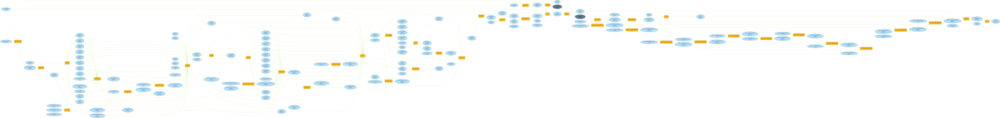

# RealEngine

My toy engine, mainly for rendering expariment and prototyping. It requires a GPU which supports DX12 Ultimate.

It is not supposed to be used in production, and prefers clean design and code over being heavily optimized (especially in CPU side).

## some highlights

* utilize latest DX12 features, such as raytracing, mesh shaders, HLSL 2021, etc.
* render graph based architecture, with automatically barriers and transient resources management
  
* fully bindless resources with SM6.6
* two-phase occlusion culling (like Ubi's GPU driven pipeline). no matter how many different meshes and textures, always two drawcalls(indirect DispatchMesh) per PSO.
* `Print`, `DrawLine` functions in shaders which can be very useful for debugging

## planned features

* render graph(~~barriers~~, ~~resource aliasing~~, async compute)
* ~~GTAO~~
* diffuse & specular GI
* clustered shading
* volume cloud
* volume fog
* ~~LPM~~
* ~~TAA~~
* ~~CAS~~
* ~~meshlet~~
* ~~RTX~~
* a reference pathtracer
* maybe water/ocean simulation, or large-scale landscape


## AMD related issues

tested on RX6600(win11, Adrenalin 21.12.1)

* PIX crashes when capturing, and works if all indirect commands removed 
* indirect DispatchMesh results in GPU hang after a few seconds
    ```cpp
    void GpuDrivenDebugPrint::Draw(IGfxCommandList* pCommandList)
    {
        ...

        if (m_pRenderer->GetDevice()->GetVendor() == GfxVendor::AMD)
        {
            pCommandList->DispatchMesh(100, 1, 1);
        }
        else
        {
            pCommandList->DispatchMeshIndirect(m_pDrawArugumentsBuffer->GetBuffer(), 0);
        }
    }
    ```
* using `SV_IsFrontFace` in an AS-MS-PS combine results in `DXGI_ERROR_DRIVER_INTERNAL_ERROR` when creating the PSO
    ```
    D3D12: Removing Device.
    D3D12 WARNING: ID3D12Device::RemoveDevice: Device removal has been triggered for the following reason (DXGI_ERROR_DRIVER_INTERNAL_ERROR: There is strong evidence that the driver has performed an undefined operation; but it may be because the application performed an illegal or undefined operation to begin with.). [ EXECUTION WARNING #233: DEVICE_REMOVAL_PROCESS_POSSIBLY_AT_FAULT]
    ```