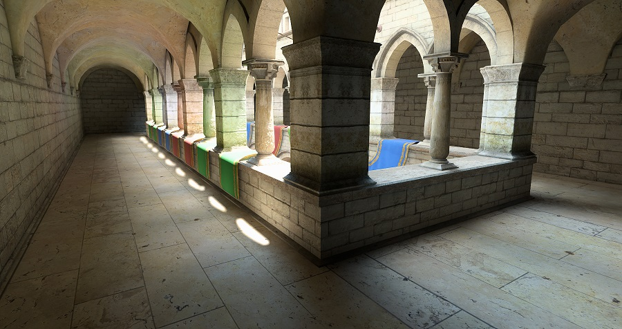
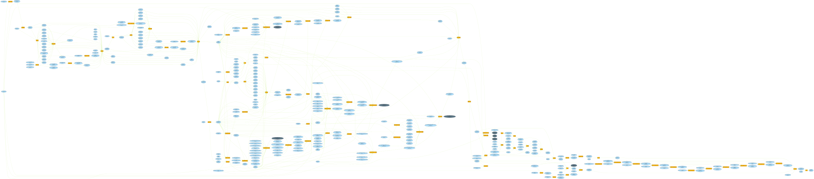

# RealEngine

My toy engine, mainly for rendering experiment and prototyping. 
It requires a GPU which supports DX12 Ultimate with latest driver.
It is not supposed to be used in production, and prefers clean design and code over being heavily optimized.


## some highlights

* utilize latest DX12 features, such as raytracing, mesh shaders, HLSL 2021, etc.
* render graph based architecture, with automatically barriers and transient resources management
  
* fully bindless resources with SM6.6
* two-phase occlusion culling (like Ubi's GPU driven pipeline). no matter how many different meshes and textures, always two drawcalls(indirect DispatchMesh) per PSO.
* hybrid rendering with raytracing
* `Print`, `DrawLine` functions in shaders which can be very useful for debugging

## planned features

* ~~render graph~~(~~barriers~~, ~~resource aliasing~~, ~~async compute~~)
* ~~GTAO~~
* ~~specular GI~~
* ~~diffuse GI~~
* clustered shading
* ~~Bloom~~
* ~~Auto Exposure~~
* ~~TAA~~
* ~~CAS~~
* ~~meshlet~~
* ~~RTX~~
* ~~a reference pathtracer~~
* ~~FSR2~~/~~DLSS~~/~~XeSS~~
* DOF
* motion blur
* visibility buffer
* Direct Storage
* maybe  volumetric cloud/fog, water/ocean simulation, large-scale landscape, or any random things


## AMD related issues

tested on RX6600(win11, Adrenalin 22.10.01.03)

* using `SV_IsFrontFace` in an AS-MS-PS combine results in `DXGI_ERROR_DRIVER_INTERNAL_ERROR` when creating the PSO
    ```
    D3D12: Removing Device.
    D3D12 WARNING: ID3D12Device::RemoveDevice: Device removal has been triggered for the following reason (DXGI_ERROR_DRIVER_INTERNAL_ERROR: There is strong evidence that the driver has performed an undefined operation; but it may be because the application performed an illegal or undefined operation to begin with.). [ EXECUTION WARNING #233: DEVICE_REMOVAL_PROCESS_POSSIBLY_AT_FAULT]
    ```
* `denoiser_reproject.hlsl` compiled with `-O0 ` crashes when creating the PSO
* `HSR - raytrace` pass with async compute results in GPU hang

## third party licenses

* [DLSS](https://github.com/NVIDIA/DLSS/blob/main/LICENSE.txt)
* [XeSS](https://github.com/intel/xess/blob/main/licenses/LICENSE.pdf)
